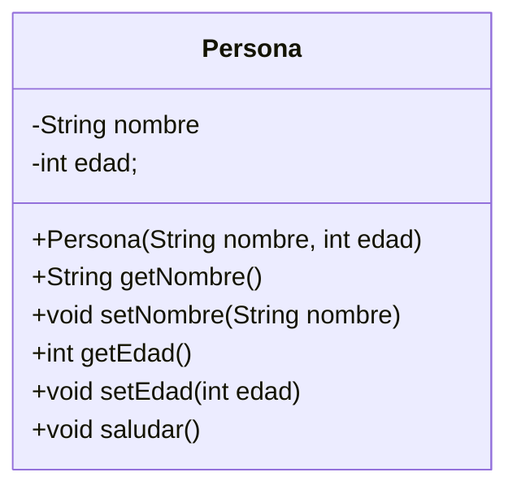

# Clases, Objetos, Constructores y Encapsulamiento


## Clases y Objetos: Los Fundamentos de la POO

La Programación Orientada a Objetos se basa en dos conceptos principales: **clases** y **objetos**.


- **Clase**: Una clase es como un **plano**, una **plantilla** o un **molde** para crear objetos. Define las características (atributos) y las acciones (métodos) que todos los objetos de ese tipo tendrán. No es un objeto en sí misma, sino la descripción de cómo deben ser los objetos de esa categoría.

    

- La clase `Carro` define que todos los carros tendrán un color, una marca, una velocidad, etc., y podrán arrancar, acelerar, etc.

    ```mermaid
    classDiagram
        class Carro {
            String color
            String marca
            double velocidad
            void arrancar()
            void acelerar()
        }
    ```

- La clase `Perro` define que todos los perros tendrán una raza, un nombre, etc., y podrán ladrar, correr, etc.

    ```mermaid
    classDiagram
    class Perro {
        String raza
        String nombre
        void ladrar()
        void correr()
    }
    ```

- **Objeto**: En el mundo real, un objeto es cualquier entidad que tiene **características** (estado) y puede realizar **acciones** (comportamiento). Por ejemplo:
  - Un **carro**: Características (color, marca, modelo, velocidad actual), Acciones (arrancar, acelerar, frenar, girar).
  - Un **perro**: Características (raza, nombre, edad, color de pelo), Acciones (ladrar, correr, comer, dormir).
  - Una **persona**: Características (nombre, edad, altura, color de ojos), Acciones (caminar, hablar, comer, trabajar).

  En programación, un **objeto** es una instancia concreta de una clase. Es una "cosa" que existe en la memoria de tu computadora y tiene un estado (valores en sus atributos) y puede realizar acciones (ejecutar sus métodos).

  

  

- **Relación Clase-Objeto**: La clase es la definición abstracta; el objeto es la materialización concreta de esa definición. Puedes crear muchos objetos a partir de una sola clase, y cada objeto tendrá su propio estado independiente.

  ```mermaid
  graph TD
      A[Clase Carro] --> B(Objeto miCarro);
      A --> C(Objeto otroCarro);
      B -- "color: rojo\nvelocidad: 50" --> D(Estado);
      B -- "acelerar()\nfrenar()" --> E(Comportamiento);
      C -- "color: azul\nvelocidad: 0" --> F(Estado);
      C -- "acelerar()\nfrenar()" --> G(Comportamiento);
  ```

  

En Java, defines una clase usando la palabra clave `class`:

```Java
public class NombreDeMiClase {
    // Aquí van los atributos (variables)
    // Aquí van los métodos (funciones)
}
```

Por convención, los nombres de las clases en Java se escriben en `PascalCase` o `UperCamelCase` (la primera letra de cada palabra en mayúscula, sin espacios).

## Los Pilares de la Programación Orientada a Objetos

La POO se sustenta en cuatro **principios fundamentales** (**pilares**) que guían el diseño y la estructura del código. En esta clase, nos enfocaremos en el primero (Encapsulamiento), y en las próximas clases exploraremos los demás en detalle.

1. **Encapsulamiento**: Consiste en agrupar los datos (atributos) y los métodos que operan sobre ellos en una sola unidad (la clase), y **ocultar los detalles internos** del objeto, exponiendo solo lo necesario a través de una interfaz pública (métodos). Esto protege los datos y controla su acceso.
2. **Abstracción**: Se enfoca en mostrar solo las características esenciales de un objeto y ocultar los detalles complejos de su implementación. Es como usar un control remoto: no necesitas saber cómo funciona internamente, solo qué botones presionar para cambiar de canal o subir el volumen. Creamos clases que representan conceptos del mundo real de forma simplificada.
3. **Herencia**: Permite que una nueva clase (subclase o clase hija) herede atributos y métodos de una clase existente (superclase o clase padre). Esto fomenta la reutilización de código y establece relaciones "es un tipo de" (ej. Un `Perro` es un tipo de `Animal`).
4. **Polimorfismo**: Significa "_muchas formas_". Permite que objetos de diferentes clases respondan al mismo mensaje (llamada a método) de maneras diferentes, según su tipo específico. Es como tener un botón "Reproducir" en diferentes dispositivos (un reproductor de música, un reproductor de video); la acción es la misma, pero la implementación interna varía.

Estos principios trabajan juntos para crear código más organizado, flexible, reutilizable y fácil de mantener.

## Atributos y Métodos: Definiendo el Estado y Comportamiento

Dentro de una clase, defines los atributos y los métodos que tendrán los objetos creados a partir de ella.

- **Atributos**: Son variables que representan las **características** o el **estado** de un objeto. Se declaran dentro de la clase, pero fuera de cualquier método (variables de instancia). Cada objeto creado a partir de la clase tendrá su propia copia de estos atributos.

  ```Java
  public class Perro {
      // Atributos
      String raza;
      String nombre;
      int edad;
      String colorPelo;
  }
  ```

- **Métodos**: Son las funciones (que ya vimos en el Módulo 1) que definen el **comportamiento** o las **acciones** que un objeto puede realizar. Se declaran dentro de la clase. Los métodos de un objeto pueden acceder y modificar los atributos de ese objeto.

  ```Java
  public class Perro {
      // Atributos
      String raza;
      String nombre;
      int edad;
      String colorPelo;

      // Métodos
      public void ladrar() {
          System.out.println("¡Guau guau!");
      }

      public void comer(String comida) {
          System.out.println(nombre + " está comiendo " + comida + ".");
      }

      public String obtenerNombre() {
          return nombre; // Un método puede acceder a los atributos
      }
  }
  ```

  Nota que los métodos asociados a objetos (no `static`) no necesitan recibir el objeto como parámetro; pueden acceder directamente a sus propios atributos (nombre en el ejemplo comer y obtenerNombre).

## Constructores: Dando Vida a los Objetos

Un **constructor** es un tipo especial de método que se utiliza para **crear** (**instanciar**) objetos de una clase e inicializar sus atributos. Se llama automáticamente cuando usas la palabra clave `new`.

- Un constructor tiene el **mismo nombre que la clase**.
- Un constructor **no tiene tipo de retorno**, ni siquiera `void`.

```Java
public class Perro {
    String raza;
    String nombre;
    int edad;
    String colorPelo;

    // Constructor (tiene el mismo nombre que la clase y no tiene retorno)
    public Perro() {
        System.out.println("Se ha creado un nuevo perro.");
        // Aquí podrías inicializar atributos con valores por defecto si quisieras
        this.raza = "Mestizo";
        this.edad = 0;
    }

    // ... otros métodos ...
}
```

### Constructor por Defecto

Si no defines _ningún_ constructor en tu clase, Java automáticamente proporciona un **constructor por defecto** (sin parámetros) que inicializa los atributos con valores predeterminados (0 para tipos numéricos, `null` para objetos, `false` para booleanos).

### Constructores Parametrizados

Puedes definir tus propios constructores que acepten **parámetros**. Esto te permite inicializar los atributos del objeto con valores específicos en el momento de su creación.

```Java
public class Perro {
    String raza;
    String nombre;
    int edad;
    String colorPelo;

    // Constructor por defecto (si no defines otro, Java lo crea)
    // public Perro() { ... } // Java lo crea si no hay otros

    // Constructor Parametrizado
    // Recibe valores para inicializar los atributos
    public Perro(String raza, String nombre, int edad, String colorPelo) {
        // Uso de 'this.': Se refiere al atributo de la instancia actual
        // Esto es necesario cuando el parámetro tiene el mismo nombre que el atributo
        this.raza = raza;
        this.nombre = nombre;
        this.edad = edad;
        this.colorPelo = colorPelo;
        System.out.println("Se ha creado un perro llamado " + this.nombre + ".");
    }

    // ... otros métodos ...
}
```

Si defines _cualquier_ constructor (parametrizado o no), Java **ya no proporciona** el constructor por defecto automáticamente. Si quieres tener ambos (uno sin parámetros y uno con parámetros), debes definirlos explícitamente.

### La Palabra Clave `this`

La palabra clave `this` en Java se refiere a la **instancia actual** del objeto. Es decir, dentro de un método o constructor de una clase, `this` representa al objeto específico sobre el cual se está operando en ese momento.

Sus usos más comunes son:

1. **Para diferenciar entre atributos de instancia y parámetros/variables locales con el mismo nombre**: Este es el uso más frecuente, especialmente en constructores y setters. Si un parámetro de un método o constructor tiene el mismo nombre que un atributo de la clase, puedes usar `this.nombreAtributo` para referirte al atributo de la instancia, y simplemente `nombreParametro` para referirte al parámetro.

    ```Java
    public class EjemploThis {
        private String nombre; // Atributo de instancia

        // Constructor con un parámetro llamado 'nombre'
        public EjemploThis(String nombre) {
            // Sin 'this.nombre', Java asumiría que te refieres al parámetro 'nombre' en ambos lados
            this.nombre = nombre; // Asigna el valor del parámetro 'nombre' al atributo de instancia 'this.nombre'
        }

        // Setter con un parámetro llamado 'nombre'
        public void setNombre(String nombre) {
            this.nombre = nombre; // Asigna el valor del parámetro 'nombre' al atributo de instancia 'this.nombre'
        }

        public String getNombre() {
            return this.nombre; // También puedes usar 'this' aquí, aunque no es estrictamente necesario si no hay ambigüedad
        }

        public void imprimirNombre() {
            String nombre = "Variable local"; // Variable local con el mismo nombre
            System.out.println("Variable local: " + nombre); // Se refiere a la variable local
            System.out.println("Atributo de instancia: " + this.nombre); // Se refiere al atributo de la instancia
        }

        public static void main(String[] args) {
            EjemploThis obj = new EjemploThis("Nombre del Objeto");
            obj.imprimirNombre();
            // Salida:
            // Variable local: Variable local
            // Atributo de instancia: Nombre del Objeto
        }
    }
    ```

2. **Para llamar a otro constructor de la misma clase**: Puedes usar `this(...)` dentro de un constructor para llamar a otro constructor de la misma clase (conocido como encadenamiento de constructores). Esto es útil para evitar duplicar código de inicialización. La llamada a `this(...)` debe ser la primera sentencia dentro del constructor.

    ```Java
    public class Persona {
        private String nombre;
        private int edad;

        // Constructor principal
        public Persona(String nombre, int edad) {
            this.nombre = nombre;
            this.edad = edad;
        }

        // Constructor secundario que solo recibe el nombre
        public Persona(String nombre) {
            // Llama al constructor principal, pasando el nombre recibido y una edad por defecto
            this(nombre, 0);
            // Cualquier otro código iría aquí, después de la llamada a this(...)
            System.out.println("Objeto Persona creado solo con nombre.");
        }

        public String getNombre() { return this.nombre; }
        public int getEdad() { return this.edad; }

        public static void main(String[] args) {
            Persona p1 = new Persona("Ana", 25); // Llama al constructor(String, int)
            System.out.println(p1.getNombre() + " - " + p1.getEdad()); // Ana - 25

            Persona p2 = new Persona("Juan"); // Llama al constructor(String)
            System.out.println(p2.getNombre() + " - " + p2.getEdad()); // Juan - 0
        }
    }
    ```

3. **Para pasar la instancia actual como argumento a otro método**: Menos común al inicio, pero `this` puede usarse para pasar el objeto actual a otro método.

En resumen, `this` es una referencia al objeto actual y es crucial para desambiguar nombres y para la comunicación entre constructores.

### 4.4. Creando Objetos (`new`)

Para crear un objeto (una **instancia**) de una clase, usas la palabra clave `new` seguida de una llamada a uno de los constructores de la clase.

```Java
public class EjemploCreacionObjetos {
    public static void main(String[] args) {
        // Creamos un objeto Perro usando el constructor por defecto (si existe)
        // Perro miPrimerPerro = new Perro(); // Llama al constructor Perro()

        // Creamos un objeto Perro usando el constructor parametrizado
        Perro miPerro = new Perro("Labrador", "Buddy", 3, "Dorado"); // Llama al constructor Perro(String, String, int, String)

        // Creamos otro objeto Perro
        Perro otroPerro = new Perro("Poodle", "Max", 5, "Blanco"); // Otro objeto independiente

        // Cada objeto tiene su propio estado
        // System.out.println(miPerro.nombre); // Esto podría dar error si nombre es privado (¡lo veremos pronto!)
        // System.out.println(otroPerro.nombre);

        // miPerro.ladrar(); // Buddy ladra
        // otroPerro.comer("croquetas"); // Max come croquetas
    }
}
```

Cuando creas un objeto, le asignas una **referencia** a una variable (ej. `miPerro`, `otroPerro`). Esta variable no contiene el objeto en sí, sino la dirección en memoria donde se encuentra el objeto.

## Encapsulamiento: Protegiendo tus Datos

El **encapsulamiento** es uno de los principios fundamentales de la POO. Consiste en agrupar los datos (atributos) y los métodos que operan sobre esos datos dentro de una única unidad (la clase), y **restringir el acceso directo** a los atributos desde fuera de la clase.

**¿Por qué encapsular?**

- **Control y Validación**: Puedes controlar cómo se acceden o modifican los datos. Por ejemplo, puedes evitar que se asigne una edad negativa a un objeto `Persona`.
- **Protección de Integridad**: Evita que otras partes del programa modifiquen los datos de un objeto de forma inesperada o incorrecta.
- **Flexibilidad**: Puedes cambiar la implementación interna de la clase (cómo almacenas o calculas algo) sin afectar el código que usa la clase, siempre y cuando la forma de interactuar (los métodos públicos) no cambie.

El encapsulamiento se logra principalmente utilizando **modificadores de acceso** para controlar la visibilidad de los atributos y métodos.

### Modificadores de Acceso (Visibilidad)

Especifican desde dónde se puede acceder a los miembros de una clase (atributos o métodos).

- `public`: El miembro es accesible desde **cualquier otra clase**. Se usa típicamente para los métodos que definen la interfaz pública de la clase (lo que el objeto "expone" al mundo exterior).
- `private`: El miembro es accesible **únicamente dentro de la misma clase**. Se usa típicamente para los atributos para protegerlos del acceso directo externo.
- `protected`: (Lo veremos en detalle en Herencia) Accesible dentro de la misma clase, clases del mismo paquete y subclases.
- **(default o package-private)**: Si no especificas ningún modificador, el miembro es accesible dentro de la misma clase y todas las demás clases en el **mismo paquete**.

### Getters y Setters (Convención JavaBeans / POJO)

Para permitir que otras clases interactúen con los atributos privados de un objeto de manera controlada, se utilizan métodos públicos especiales llamados **getters** y **setters**. Esta es una convención estándar en Java, especialmente para las clases que representan datos (conocidas como POJO - Plain Old Java Object, o JavaBeans en contextos más antiguos).

- **Getters (Métodos de Acceso)**: Métodos públicos que permiten **obtener** el valor de un atributo privado.
  
  **Nomenclatura**: `public tipoDato getNombreAtributo()`. Para atributos booleanos, a menudo se usa `public boolean isNombreAtributo()`.

  ```Java
  public class Perro {
      private String nombre; // Atributo privado

      // ... constructor ...

      // Getter para el nombre
      public String getNombre() {
          return this.nombre; // Accede al atributo privado desde dentro de la clase
      }

      // ... otros atributos y métodos ...
  }
  ```

- **Setters (Métodos de Modificación)**: Métodos públicos que permiten **modificar** el valor de un atributo privado. A menudo incluyen lógica de validación.

  **Nomenclatura**: `public void setNombreAtributo(tipoDato nuevoValor)`.

  ```Java
  public class Perro {
      private int edad; // Atributo privado

      // ... constructor ...

      // Setter para la edad con validación
      public void setEdad(int edad) {
          if (edad >= 0) { // Validación simple
              this.edad = edad; // Asigna el valor solo si es válido
          } else {
              System.out.println("Error: La edad no puede ser negativa.");
          }
      }

      // Getter para la edad
      public int getEdad() {
          return this.edad;
      }

      // ... otros atributos y métodos ...
  }
  ```

**Ejemplo Completo con Encapsulamiento**:

```Java
public class Persona {
    private String nombre; // Atributos privados
    private int edad;

    // Constructor
    public Persona(String nombre, int edad) {
        this.nombre = nombre;
        // Usamos el setter para inicializar la edad, aplicando la validación desde el inicio
        setEdad(edad);
    }

    // Getter para nombre
    public String getNombre() {
        return this.nombre;
    }

    // Setter para nombre (podría tener validación, ej. no vacío)
    public void setNombre(String nombre) {
        this.nombre = nombre;
    }

    // Getter para edad
    public int getEdad() {
        return this.edad;
    }

    // Setter para edad con validación
    public void setEdad(int edad) {
        if (edad >= 0) {
            this.edad = edad;
        } else {
            System.out.println("Error: Edad inválida.");
        }
    }

    // Método de comportamiento
    public void saludar() {
        System.out.println("Hola, mi nombre es " + this.nombre + " y tengo " + this.edad + " años.");
    }

    public static void main(String[] args) {
        Persona p1 = new Persona("Ana", 25); // Crea objeto usando constructor
        Persona p2 = new Persona("Juan", -5); // Intenta crear con edad inválida

        p1.saludar(); // Salida: Hola, mi nombre es Ana y tengo 25 años.
        p2.saludar(); // Salida: Error: Edad inválida. Hola, mi nombre es Juan y tengo 0 años. (edad se inicializa a 0 por defecto si el setter falla)

        // Acceso y modificación controlada con getters y setters
        System.out.println("Nombre de p1: " + p1.getNombre()); // Usa getter
        p1.setEdad(26); // Usa setter válido
        p1.setEdad(-10); // Usa setter inválido

        // p1.edad = 30; // ERROR de compilación: El atributo 'edad' es privado
    }
}
```



## Ejercicio Práctico en Clase: Creando y Usando Objetos Encapsulados

Ahora, vamos a aplicar los conceptos de clase, objeto, constructor y encapsulamiento creando una clase simple y utilizándola.

**Objetivo del Ejercicio**: Crear una clase `Libro`, definir sus atributos, usar un constructor para crear objetos `Libro`, y mostrar su información de forma segura utilizando métodos de acceso (getters).

### Crear la Clase `Libro`

Crea un nuevo archivo Java llamado `Libro.java`. Asegúrate de que no tenga un método `main` por ahora; solo la definición de la clase.

```Java
public class Libro {
    // Aquí irán los atributos
    // Aquí irán los constructores
    // Aquí irán los métodos (getters/setters, otros comportamientos)
}
```

### Definir Atributos (Privados)

Dentro de la clase `Libro`, declara los siguientes atributos. Hazlos **privados** para aplicar el encapsulamiento.

- `titulo` (tipo `String`)
- `autor` (tipo `String`)
- `isbn` (tipo `String`)
- `precio` (tipo `double`)

```Java
public class Libro {
    private String titulo;
    private String autor;
    private String isbn;
    private double precio;

    // ... resto de la clase ...
}
```

### Crear un Constructor Parametrizado

Crea un constructor para la clase `Libro` que acepte parámetros para inicializar todos los atributos al crear un objeto. Utiliza la palabra clave `this`.

```Java
public class Libro {
    private String titulo;
    private String autor;
    private String isbn;
    private double precio;

    // Constructor
    public Libro(String titulo, String autor, String isbn, double precio) {
        this.titulo = titulo;
        this.autor = autor;
        this.isbn = isbn;
        this.precio = precio;
    }

    // ... resto de la clase ...
}
```

### Implementar Getters (Métodos de Acceso)

Crea métodos públicos (**getters**) para permitir que otras clases puedan obtener el valor de cada atributo privado.

```Java
public class Libro {
    private String titulo;
    private String autor;
    private String isbn;
    private double precio;

    // Constructor
    public Libro(String titulo, String autor, String isbn, double precio) {
        this.titulo = titulo;
        this.autor = autor;
        this.isbn = isbn;
        this.precio = precio;
    }

    // Getters
    public String getTitulo() {
        return this.titulo;
    }

    public String getAutor() {
        return this.autor;
    }

    public String getIsbn() {
        return this.isbn;
    }

    public double getPrecio() {
        return this.precio;
    }

    // ... resto de la clase ...
}
```

_(Opcional: Si el tiempo permite, discute brevemente la idea de setters y cómo se añadirían, quizás con una validación simple para el precio, pero sin implementarlos completamente si el tiempo es limitado)._

### Crear la Clase Principal con `main`

Crea un nuevo archivo Java llamado `BibliotecaApp.java` (o similar). Este archivo sí tendrá el método `main`.

```Java
public class BibliotecaApp {
    public static void main(String[] args) {
        // Aquí crearemos y usaremos objetos Libro
    }
}
```

### Crear Objetos `Libro` en `main`

Dentro del método `main` de `BibliotecaApp.java`, crea al menos dos objetos de la clase `Libro` utilizando el constructor que definiste.

```Java
public class BibliotecaApp {
    public static void main(String[] args) {
        // Crear objetos Libro usando el constructor
        Libro libro1 = new Libro("Cien años de soledad", "Gabriel García Márquez", "978-0307474278", 15.99);
        Libro libro2 = new Libro("1984", "George Orwell", "978-0451524935", 9.50);

        // ... mostrar información ...
    }
}
```

### Mostrar Información de Forma Segura (Usando Getters)

- Desde el método `main`, accede a la información de los objetos `libro1` y `libro2` utilizando los **métodos getter** que creaste en la clase Libro.
- Imprime la información de cada libro en la consola de forma legible, quizás usando `System.out.printf()` para formatear el precio.

```Java
public class BibliotecaApp {
    public static void main(String[] args) {
        Libro libro1 = new Libro("Cien años de soledad", "Gabriel García Márquez", "978-0307474278", 15.99);
        Libro libro2 = new Libro("1984", "George Orwell", "978-0451524935", 9.50);

        System.out.println("--- Información de Libros ---");

        // Mostrar información del libro 1 usando getters
        System.out.println("Libro 1:");
        System.out.println("  Título: " + libro1.getTitulo());
        System.out.println("  Autor: " + libro1.getAutor());
        System.out.println("  ISBN: " + libro1.getIsbn());
        System.out.printf("  Precio: $%.2f%n", libro1.getPrecio()); // Formatear precio

        System.out.println("\nLibro 2:");
        System.out.println("  Título: " + libro2.getTitulo());
        System.out.println("  Autor: " + libro2.getAutor());
        System.out.println("  ISBN: " + libro2.getIsbn());
        System.out.printf("  Precio: $%.2f%n", libro2.getPrecio()); // Formatear precio

        // Intenta acceder directamente a un atributo privado (mostrará error de compilación)
        // System.out.println(libro1.titulo); // ERROR!

        System.out.println("-----------------------------");
    }
}
```

### Compilar y Ejecutar

- Compila ambos archivos (`Libro.java` y `BibliotecaApp.java`). Puedes hacerlo desde la terminal navegando a la carpeta y ejecutando `javac Libro.java BibliotecaApp.java`.
- Ejecuta el programa principal: `java BibliotecaApp`.
- Verifica que la información de los libros se muestra correctamente en la consola.

### Mejoras que se pueden aplicar al ejercicio (Opcional)

#### 1. Método adicional a la clase `Libro`

Agregar un método que permita mostrar la información del libro directamente desde la clase `Libro`.

```Java
public void mostrarInformacion() {
    System.out.println("  Título: " + this.titulo);
    System.out.println("  Autor: " + this.autor);
    System.out.println("  ISBN: " + this.isbn);
    System.out.printf("  Precio: $%.2f%n", this.precio);
}
```

Asi, el llamado desde el main cambiaría por:

```Java
public class BibliotecaApp {
    public static void main(String[] args) {
        Libro libro1 = new Libro("Cien años de soledad", "Gabriel García Márquez", "978-0307474278", 15.99);
        Libro libro2 = new Libro("1984", "George Orwell", "978-0451524935", 9.50);

        System.out.println("--- Información de Libros ---");

        // Mostrar información del libro 1 usando getters
        System.out.println("Libro 1:");
        libro1.mostrarInformacion();

        System.out.println("\nLibro 2:");
        libro2.mostrarInformacion();

        System.out.println("-----------------------------");
    }
```

#### 2. Ejemplo de Validación en un Setter

Aunque los setters son opcionales en este punto, podríamos incluir un ejemplo de cómo validar un atributo, como el precio, para reforzar la importancia del control de acceso.

```Java
public void setPrecio(double precio) {
    if (precio > 0) {
        this.precio = precio;
    } else {
        System.out.println("El precio debe ser mayor a 0.");
    }
}
```

#### 3. Comparar Objetos

Podríamos incluir un método donde se comparen dos objetos `Libro` para verificar si tienen el mismo `ISBN`, reforzando la idea de que los objetos tienen atributos únicos.

```Java
public boolean esMismoLibro(Libro otroLibro) {
    return this.isbn.equals(otroLibro.getIsbn());
}
```
