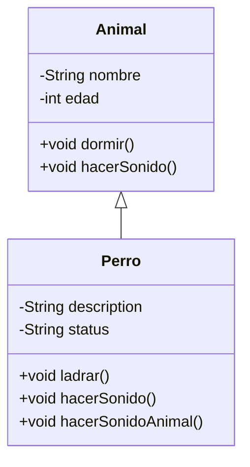
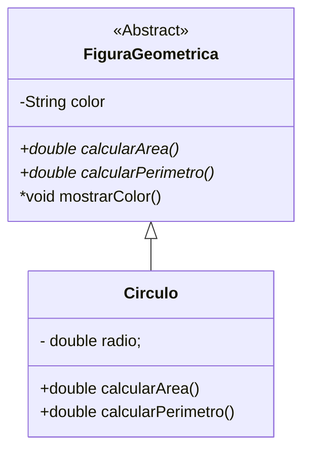
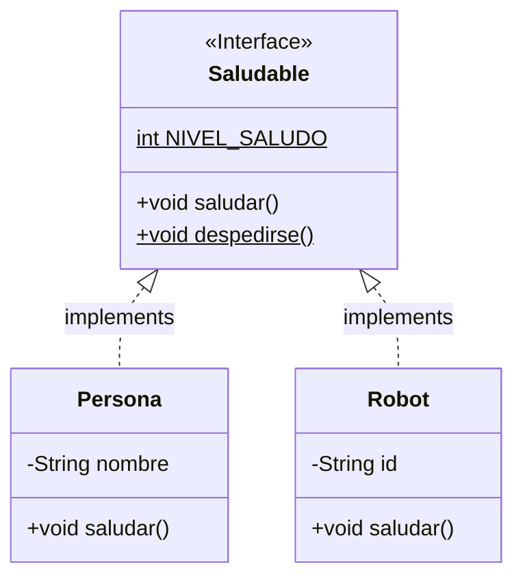
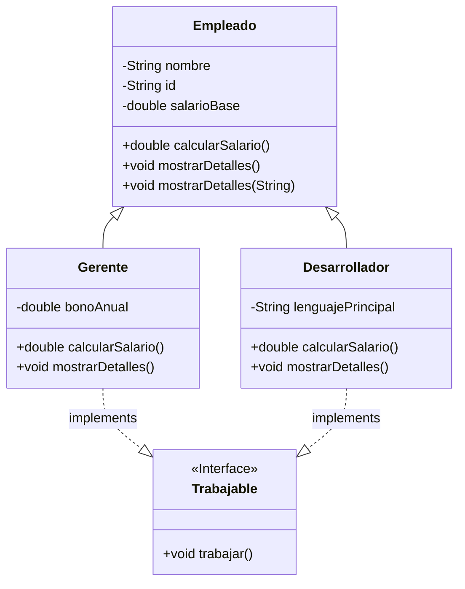

# Herencia, Polimorfismo e Interfaces

## 1. Herencia: Construyendo sobre lo Existente

La **herencia** es un mecanismo de la POO que permite que una clase (llamada **subclase**, **clase hija** o **clase derivada**) herede atributos y métodos de otra clase (llamada **superclase**, **clase padre** o **clase base**). Esto modela la relación "_es un tipo de_".

- **¿Por qué usar Herencia?**
  - **Reutilización de Código**: Evitas repetir la definición de atributos y métodos comunes en múltiples clases.
  - **Organización**: Crea una estructura jerárquica clara en tu código.
  - **Especialización**: Una subclase hereda lo general de la superclase y añade sus propias características o modifica comportamientos para volverse más específica.

En Java, la herencia se indica con la palabra clave `extends`. Una clase hija hereda todos los miembros `public` y `protected` de su clase padre. Los miembros `private` de la clase padre no se heredan directamente (aunque se puede acceder a ellos a través de métodos públicos/protected heredados).



```Java
// Superclase (Clase Padre)
public class Animal {
    private String nombre; // Atributo privado
    protected int edad; // Atributo protegido (accesible por clases hijas)

    public Animal(String nombre, int edad) {
        this.nombre = nombre;
        this.edad = edad;
    }

    public String getNombre() { // Método público
        return this.nombre;
    }

    public void dormir() { // Método público
        System.out.println(this.nombre + " está durmiendo.");
    }

    // Método que las clases hijas podrían querer sobrescribir
    public void hacerSonido() {
        System.out.println("El animal hace un sonido.");
    }
}
```

```Java
// Subclase (Clase Hija)
// Perro hereda de Animal (un Perro ES UN TIPO DE Animal)
public class Perro extends Animal {
    private String raza; // Atributo propio de Perro

    // Constructor de Perro
    public Perro(String nombre, int edad, String raza) {
        // Llamada al constructor de la superclase (Animal)
        // DEBE ser la primera sentencia en el constructor de la subclase
        super(nombre, edad);
        this.raza = raza; // Inicializa el atributo propio de Perro
    }

    // Método propio de Perro
    public void ladrar() {
        System.out.println(this.getNombre() + " dice: ¡Guau guau!"); // Accede al nombre usando el getter heredado
    }

    // Sobrescritura del método hacerSonido() de la superclase
    @Override // Anotación opcional pero recomendada
    public void hacerSonido() {
        System.out.println(this.getNombre() + " ladra fuertemente.");
    }

    // Puedes llamar al método de la superclase usando super.
    public void hacerSonidoAnimal() {
         super.hacerSonido(); // Llama a la versión de Animal
    }

    public static void main(String[] args) {
        Perro miPerro = new Perro("Buddy", 3, "Labrador");

        System.out.println("Mi perro se llama: " + miPerro.getNombre()); // Método heredado
        miPerro.dormir(); // Método heredado
        miPerro.ladrar(); // Método propio de Perro
        miPerro.hacerSonido(); // Llama a la versión sobrescrita en Perro
        miPerro.hacerSonidoAnimal(); // Llama a la versión de Animal usando super.
    }
}
```

- `super()`: Se usa dentro del constructor de la subclase para llamar al constructor de la superclase. Es la forma de asegurar que la parte heredada del objeto se inicialice correctamente. Siempre debe ser la primera línea en el constructor de la subclase.
- `super.metodo()`: Se usa para llamar a una versión de un método que está definido en la superclase, incluso si ese método ha sido sobrescrito en la subclase.

**Java no permite herencia múltiple de clases**: Una clase solo puede extender de una única superclase directa.

## 2. Polimorfismo: Muchas Formas de Actuar

**Polimorfismo** significa "muchas formas". En Java, se manifiesta de dos maneras principales:

### 2.1. Polimorfismo de Sobrecarga (Method Overloading)

Ocurre cuando tienes **múltiples métodos en la misma clase con el mismo nombre**, pero con **diferentes listas de parámetros** (diferente número de parámetros, diferente tipo de parámetros o diferente orden de parámetros). El compilador decide qué método llamar basándose en los argumentos que se le pasan (esto ocurre en **tiempo de compilación**).

```Java
public class Calculadora {

    // Método 'sumar' que recibe dos enteros
    public int sumar(int a, int b) {
        System.out.println("Sumando dos enteros...");
        return a + b;
    }

    // Método 'sumar' que recibe dos doubles (mismo nombre, diferentes tipos de parámetros)
    public double sumar(double a, double b) {
        System.out.println("Sumando dos doubles...");
        return a + b;
    }

    // Método 'sumar' que recibe tres enteros (mismo nombre, diferente número de parámetros)
    public int sumar(int a, int b, int c) {
        System.out.println("Sumando tres enteros...");
        return a + b + c;
    }

    // Esto NO es sobrecarga válida (solo cambia el tipo de retorno, no la lista de parámetros)
    // public double sumar(int a, int b) { return (double)a + b; } // ERROR de compilación si el método int sumar(int, int) ya existe

    public static void main(String[] args) {
        Calculadora calc = new Calculadora();

        int res1 = calc.sumar(5, 10); // Llama a sumar(int, int)
        double res2 = calc.sumar(5.5, 10.2); // Llama a sumar(double, double)
        int res3 = calc.sumar(1, 2, 3); // Llama a sumar(int, int, int)

        System.out.println(res1); // 15
        System.out.println(res2); // 15.7
        System.out.println(res3); // 6
    }
}
```

La sobrecarga mejora la legibilidad al permitir que métodos que realizan tareas similares (pero con diferentes tipos o cantidades de datos) compartan el mismo nombre.

### 2.2. Polimorfismo de Sobrescritura (Method Overriding)

Ocurre cuando una subclase proporciona su propia implementación para un método que ya está definido en su superclase. La versión del método que se ejecuta se determina en tiempo de ejecución, basándose en el tipo real del objeto al que se hace referencia.

**Sobrescritura** (`@Override`): Es la base del polimorfismo en Java. Permite que una subclase proporcione su propia implementación de un método que ya existe en su superclase. La anotación `@Override` es una buena práctica; le dice al compilador que intentas sobrescribir un método, y te avisará si cometes un error (ej. nombre o parámetros incorrectos).

```Java
// Clase Padre (Superclase)
public class Figura {
    public void dibujar() {
        System.out.println("Dibujando una figura genérica.");
    }
}
```

```Java
// Clase Hija 1
public class Circulo extends Figura {
    @Override // Sobrescribe el método dibujar() de Figura
    public void dibujar() {
        System.out.println("Dibujando un círculo.");
    }
}
```

```Java
// Clase Hija 2
public class Cuadrado extends Figura {
    @Override // Sobrescribe el método dibujar() de Figura
    public void dibujar() {
        System.out.println("Dibujando un cuadrado.");
    }
}
```

```Java
public class EjemploPolimorfismo {
    public static void main(String[] args) {
        // Declaramos variables usando el tipo de la superclase (Figura)
        Figura miFigura1 = new Circulo(); // Una referencia Figura apunta a un objeto Circulo
        Figura miFigura2 = new Cuadrado(); // Una referencia Figura apunta a un objeto Cuadrado
        Figura miFigura3 = new Figura();   // Una referencia Figura apunta a un objeto Figura

        // Llamamos al método dibujar() usando las referencias de la superclase
        // En tiempo de ejecución, la JVM mira el tipo REAL del objeto
        miFigura1.dibujar(); // ¿Qué se imprime? -> Dibujando un círculo. (Se ejecuta el método de Circulo)
        miFigura2.dibujar(); // ¿Qué se imprime? -> Dibujando un cuadrado. (Se ejecuta el método de Cuadrado)
        miFigura3.dibujar(); // ¿Qué se imprime? -> Dibujando una figura genérica. (Se ejecuta el método de Figura)

        // El método que se ejecuta (dibujar()) depende del TIPO REAL del objeto,
        // no del tipo de la variable de referencia. ¡Esto es polimorfismo de sobrescritura!

        // Sin arrays/listas, demostramos con variables individuales:
        Figura figuraA = new Circulo();
        Figura figuraB = new Cuadrado();

        System.out.println("\nDemostrando polimorfismo sin colecciones:");
        figuraA.dibujar(); // Llama a Circulo.dibujar()
        figuraB.dibujar(); // Llama a Cuadrado.dibujar()
    }
}
```

El polimorfismo de sobrescritura te permite tratar objetos de diferentes tipos (siempre que hereden de una superclase común) de manera uniforme a través de una referencia común, y que el comportamiento específico se adapte al tipo real del objeto.

## 3. Abstracción con Clases Abstractas e Interfaces

La **abstracción** es otro pilar de la POO que se trata de simplificar la complejidad ocultando los detalles irrelevantes y mostrando solo las características esenciales. En Java, la abstracción se logra principalmente a través de **clases abstractas** e **interfaces**.

### 3.1. Clases Abstractas

Una **clase abstracta** es una clase que no se puede instanciar directamente (no puedes usar `new` con ella). Se declara usando la palabra clave `abstract`. Las clases abstractas están diseñadas para ser superclases en una jerarquía de herencia.

- **¿Por qué usar Clases Abstractas?**
  - Para definir una plantilla común para un conjunto de subclases.
  - Pueden tener **métodos abstractos**: métodos que se declaran sin implementación (solo la firma), y que las subclases concretas (no abstractas) que hereden de ella **deben** implementar.
  - Pueden tener **métodos concretos**: métodos con implementación completa, que las subclases pueden heredar y usar directamente.
  - Pueden tener atributos y constructores (aunque los constructores solo son llamados por las subclases usando `super()`).



```Java
// Clase Abstracta
public abstract class FiguraGeometrica {
    private String color; // Puede tener atributos

    public FiguraGeometrica(String color) { // Puede tener constructor
        this.color = color;
    }

    public String getColor() { // Puede tener métodos concretos
        return this.color;
    }

    // Método abstracto: No tiene implementación. Las subclases DEBEN implementarlo.
    public abstract double calcularArea(); // No hay cuerpo del método, termina en ;

    // Método abstracto: No tiene implementación. Las subclases DEBEN implementarlo.
    public abstract double calcularPerimetro();

    // Puede tener otros métodos concretos
    public void mostrarColor() {
        System.out.println("Color: " + this.color);
    }
}
```

```Java
// Clase Concreta que hereda de una clase abstracta
public class Circulo extends FiguraGeometrica {
    private double radio;

    public Circulo(String color, double radio) {
        super(color); // Llama al constructor de la superclase abstracta
        this.radio = radio;
    }

    // DEBEMOS implementar los métodos abstractos de FiguraGeometrica
    @Override
    public double calcularArea() {
        return Math.PI * radio * radio;
    }

    @Override
    public double calcularPerimetro() {
        return 2 * Math.PI * radio;
    }

    public static void main(String[] args) {
        // FiguraGeometrica miFigura = new FiguraGeometrica("Rojo"); // ERROR: No se puede instanciar una clase abstracta

        FiguraGeometrica miCirculo = new Circulo("Azul", 5.0); // Creamos un objeto de la clase CONCRETA
        miCirculo.mostrarColor(); // Usa método concreto heredado
        System.out.println("Área: " + miCirculo.calcularArea()); // Llama a la implementación de Circulo
    }
}
```

Una clase abstracta es útil para definir una base común con comportamientos que deben ser específicos para cada tipo de subclase (métodos abstractos), mientras se comparte otra lógica o estado (métodos concretos, atributos).

### 3.2. Interfaces

Una **interface** en Java es un **contrato**. Define un conjunto de métodos que cualquier clase que "implemente" esa interfaz **debe** proporcionar. Las interfaces se usan para definir capacidades o comportamientos comunes que diferentes clases pueden tener, sin importar su jerarquía de herencia.

- **¿Por qué usar Interfaces?**
  - **Definir Contratos**: Establecen qué debe hacer una clase, pero no cómo.
  - **Lograr Abstracción**: Ocultan los detalles de implementación.
  - **Simular Herencia Múltiple de Comportamiento**: Una clase puede implementar múltiples interfaces, adquiriendo los contratos de todas ellas.
  - **Polimorfismo**: Permiten tratar objetos de clases diferentes de manera uniforme si implementan la misma interfaz.

Las interfaces se declaran con la palabra clave `interface`. Los métodos declarados en una interfaz son implícitamente `public` y `abstract` (antes de Java 8; ahora pueden tener métodos `default` y `static` con implementación, pero el foco inicial está en los métodos abstractos).



```Java
// Declaración de una Interfaz
// Define un contrato: cualquier cosa que sea 'Saludable' debe saber 'saludar()'
public interface Saludable {
    // Método abstracto (implícitamente public abstract)
    void saludar(); // No tiene cuerpo, termina en ;

    // Ejemplo de constante en interfaz (implícitamente public static final)
    int NIVEL_SALUDO = 1;

    // Ejemplo de método default (Java 8+) - tiene implementación por defecto
    default void despedirse() {
        System.out.println("Adiós!");
    }
}
```

```Java
// Una clase implementa una interfaz usando la palabra clave 'implements'
public class Persona implements Saludable {
    private String nombre;

    public Persona(String nombre) {
        this.nombre = nombre;
    }

    // DEBEMOS proporcionar una implementación para el método saludar() de la interfaz
    @Override // También se usa @Override al implementar métodos de interfaz
    public void saludar() {
        System.out.println("Hola, soy " + this.nombre + ".");
    }
}
```

```Java
// Otra clase que implementa la misma interfaz
public class Robot implements Saludable {
    private String id;

    public Robot(String id) {
        this.id = id;
    }

    // DEBEMOS proporcionar una implementación para el método saludar()
    @Override
    public void saludar() {
        System.out.println("Beep boop. Saludos desde el Robot " + this.id + ".");
    }
}
```

```Java
public class EjemploInterfaces {
    public static void main(String[] args) {
        // Polimorfismo con Interfaces
        Saludable entidad1 = new Persona("Ana"); // Una referencia Saludable apunta a un objeto Persona
        Saludable entidad2 = new Robot("R2D2"); // Una referencia Saludable apunta a un objeto Robot

        // Llamamos al método definido en la interfaz
        entidad1.saludar(); // Llama a la versión de Persona
        entidad2.saludar(); // Llama a la versión de Robot
    }
}
```

### 3.3. Clases Abstractas vs. Interfaces: ¿Cuándo usar cuál?

Ambas son mecanismos de abstracción y no pueden ser instanciadas directamente, pero tienen diferencias clave:

| Característica | Clase Abstracta | Interfaz |
| --- | --- | --- |
| **Tipo de Miembros** | Atributos, métodos concretos, métodos abstractos, constructores. | Métodos abstractos(principalmente), métodos `default` y `static` (Java 8+), constantes (`public static final`). |
| **Estado (Atributos)** | Puede tener atributos de instancia (con cualquier modificador de acceso). | No puede tener atributos de instancia (solo constantes implícitas `public static final`). |
| **Implementación** | Puede tener métodos con implementación (concretos). | Métodos abstractos no tienen implementación (antes de Java 8). Métodos `default` sí (Java 8+). |
| **Constructores** | Puede tener constructores (usados por las subclases con `super()`). | No puede tener constructores. |
| **Herencia/Implementación** | Una clase `extends` una clase abstracta. | Una clase `implements` una interfaz. |
| **Herencia Múltiple** | No permite herencia múltiple (una clase solo extiende de una). | Permite implementación múltiple (una clase implementa varias). |
| **Relación** | Modela una relación "_es un tipo de_" (jerarquía fuerte). | Modela una capacidad "_puede hacer_" (contrato de comportamiento). |
| **Uso** | Cuando quieres compartir **implementación común y estado** entre clases relacionadas. | Cuando quieres definir un **contrato de comportamiento** que clases no relacionadas pueden cumplir. |

**En resumen**: Usa clases abstractas cuando tienes una base común con algo de implementación y estado que quieres compartir en una jerarquía "_es un tipo de_". Usa interfaces cuando solo quieres definir un conjunto de acciones que una clase debe realizar, sin preocuparte por cómo lo hace o si comparte estado con otras clases que implementan la misma interfaz.

## 4. Ejercicio Práctico en Clase: Jerarquía de Empleados y Contratos de Trabajo

Este ejercicio se realizará de forma guiada en clase para aplicar los conceptos de Herencia, Polimorfismo e Interfaces.

**Objetivo del Ejercicio**: Crear una jerarquía de clases que represente diferentes tipos de empleados y definir un comportamiento común a través de una interfaz.



### Crear la Clase Base `Empleado`

- Crea una clase `Empleado` con atributos básicos privados como `nombre` (String), `id` (String), y `salarioBase` (double).
- Incluye un constructor que inicialice estos atributos.
- Implementa getters para estos atributos.
- Crea un método público `calcularSalario()` que simplemente retorne el `salarioBase`.
- Crea un método público `mostrarDetalles()` que imprima el nombre, ID y salario base.
- **Añadir Sobrecarga**: Crea otro método `mostrarDetalles(String prefijo)` que imprima el `prefijo` antes de los detalles.

### Crear la Subclase `Gerente`

- Crea una clase `Gerente` que **herede** de `Empleado` usando `extends`.
- Añade un atributo privado propio de `Gerente`, como `bonoAnual` (double).
- Crea un constructor para `Gerente` que reciba nombre, id, salario base y bono anual. **Usa** `super()` en la primera línea para llamar al constructor de `Empleado`.
- Implementa un getter para `bonoAnual`.
- **Sobrescribe** (`@Override`) el método `calcularSalario()` para que retorne el `salarioBase` más el `bonoAnual`.
- **Sobrescribe** (`@Override`) el método `mostrarDetalles()` para que imprima la información básica (llamando a `super.mostrarDetalles()`) y luego añada la información del bono.

### Crear la Subclase `Desarrollador`

- Crea una clase `Desarrollador` que también **herede** de `Empleado`.
- Añade un atributo privado propio, como `lenguajePrincipal` (String).
- Crea un constructor para `Desarrollador` que use `super()`.
- Implementa un getter para `lenguajePrincipal`.
- **Sobrescribe** (`@Override`) el método `calcularSalario()` si tienen alguna regla de salario diferente (ej. salario base + un extra fijo por proyecto, o simplemente retorna el salario base si no hay extra).
- **Sobrescribe** (`@Override`) el método `mostrarDetalles()` para añadir el lenguaje principal.

### Crear la Interfaz `Trabajable`

- Crea una interfaz llamada `Trabajable`.
- Declara un método abstracto `void trabajar()`.

### Implementar la Interfaz

- Modifica las clases `Gerente` y `Desarrollador` para que **implementen** la interfaz `Trabajable` usando `implements`.
- En cada una de estas clases, proporciona una implementación concreta para el método `trabajar()`. La implementación debe imprimir un mensaje que describa la tarea típica de un gerente o un desarrollador.

### Clase Principal (`main`) para Demostración

- Crea una clase principal (ej. `EmpresaPOOApp.java`) con un método `main`.
- Dentro de `main`:
  - Crea variables individuales para objetos de `Gerente` y `Desarrollador`.

    ```Java
    Gerente miGerente = new Gerente("Ana Gerente", "G001", 5000.0, 1000.0);
    Desarrollador miDesarrollador = new Desarrollador("Juan Dev", "D001", 4000.0, "Java");
    Empleado empleadoBase = new Empleado("Pedro Base", "E001", 3000.0);
    ```

  - Llama a sus métodos `mostrarDetalles()` y `calcularSalario()` para ver los resultados específicos de cada clase.
  - **Demostración de Polimorfismo (Sobrecarga)**: Llama al método `mostrarDetalles()` de `empleadoBase` usando ambas versiones (sin parámetro y con parámetro `String`).

    ```Java
    empleadoBase.mostrarDetalles(); // Llama a mostrarDetalles() sin parámetro
    empleadoBase.mostrarDetalles("Detalles de Empleado Base:"); // Llama a mostrarDetalles(String)
    ```

  - **Demostración de Polimorfismo (Sobrescritura por Herencia)**: Crea variables usando el tipo de la superclase `Empleado` y asígnales objetos de las subclases. Llama a los métodos sobrescritos a través de estas referencias.

    ```Java
    System.out.println("\n--- Demostración de Polimorfismo por Sobrescritura (Herencia) ---");
    Empleado ref1 = miGerente; // Referencia Empleado apunta a objeto Gerente
    Empleado ref2 = miDesarrollador; // Referencia Empleado apunta a objeto Desarrollador

    ref1.mostrarDetalles(); // Llama a la versión de Gerente en tiempo de ejecución
    System.out.println("Salario calculado para ref1: " + ref1.calcularSalario()); // Llama a la versión de Gerente
    ref2.mostrarDetalles(); // Llama a la versión de Desarrollador en tiempo de ejecución
    System.out.println("Salario calculado para ref2: " + ref2.calcularSalario()); // Llama a la versión de Desarrollador
    ```

  - **Demostración de Polimorfismo (Interfaces)**: Crea variables usando el tipo de la interfaz `Trabajable` y asígnales objetos de las clases que la implementan. Llama al método `trabajar()`.

    ```Java
    System.out.println("\n--- Demostración de Polimorfismo con Interfaces ---");
    Trabajable t1 = miGerente; // Referencia Trabajable apunta a objeto Gerente
    Trabajable t2 = miDesarrollador; // Referencia Trabajable apunta a objeto Desarrollador

    t1.trabajar(); // Llama a la implementación de Gerente
    t2.trabajar(); // Llama a la implementación de Desarrollador
    ```
