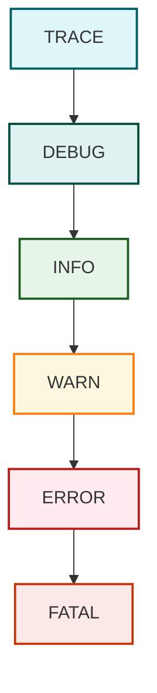

# Introducción a los Logs y la Depuración

## ¿Qué son los logs?
Los logs son registros de eventos que ocurren durante la ejecución de una aplicación. Estos registros permiten a los desarrolladores y administradores monitorear el comportamiento del sistema, detectar errores y entender la secuencia de eventos.

## Importancia del logging en el desarrollo y mantenimiento de aplicaciones
El logging es fundamental para:
- Diagnosticar errores sin necesidad de depuración interactiva.
- Analizar el comportamiento de la aplicación en producción.
- Auditar eventos importantes de negocio o seguridad.
- Mejorar la trazabilidad y mantenibilidad del código.

## Beneficios de usar logs
- **Monitoreo en tiempo real** de la aplicación.
- **Depuración más eficiente** al tener trazas claras.
- **Historial de eventos** para análisis post mortem.
- **Facilidad para cumplir con regulaciones** que exigen auditoría.

## Herramientas de Logging en Java

| Herramienta         | Pros                                          | Contras                                       |
|---------------------|-----------------------------------------------|-----------------------------------------------|
| java.util.logging   | Integrado en JDK                              | Menos flexible y potente que alternativas     |
| Log4j               | Muy configurable, gran comunidad               | Vulnerabilidades en versiones antiguas        |
| Logback             | Basado en Log4j, compatible con SLF4J         | Más complejo para principiantes               |
| SLF4J               | API de fachada, permite cambiar backend       | Necesita backend (Log4j, Logback, etc.)       |
| tinylog             | Muy ligero, ideal para microservicios         | Menos soporte y características avanzadas     |

## Configuración de Log4j para Maven y Gradle

### Maven

```xml
<dependencies>
    <dependency>
        <groupId>org.apache.logging.log4j</groupId>
        <artifactId>log4j-core</artifactId>
        <version>2.20.0</version>
    </dependency>
    <dependency>
        <groupId>org.apache.logging.log4j</groupId>
        <artifactId>log4j-api</artifactId>
        <version>2.20.0</version>
    </dependency>
</dependencies>
```

### Gradle

```groovy
dependencies {
    implementation 'org.apache.logging.log4j:log4j-core:2.20.0'
    implementation 'org.apache.logging.log4j:log4j-api:2.20.0'
}
```

## Niveles de log y manejo de mensajes
Log4j y otras bibliotecas definen varios niveles de logging, por orden de severidad:

- `TRACE`: Detalles muy finos, usados para diagnosticar problemas.
- `DEBUG`: Información útil para depuración.
- `INFO`: Eventos normales del sistema.
- `WARN`: Algo inesperado, pero la aplicación sigue funcionando.
- `ERROR`: Error que no detiene la aplicación.
- `FATAL`: Error crítico que probablemente detenga la aplicación.
## Jerarquía de niveles de log en Log4j

Los niveles de log siguen una jerarquía de menor a mayor severidad. Si configuras tu logger en un cierto nivel, **registrará ese nivel y todos los más severos**, pero ignorará los de menor nivel.


Por ejemplo, si configuras el nivel en `INFO`, se registrarán mensajes `INFO`, `WARN`, `ERROR` y `FATAL`, pero no `DEBUG` ni `TRACE`.


Ejemplo en Log4j:

```java
logger.info("Inicio de la aplicación");
logger.error("Error al conectar a la base de datos");
```

## Ejemplo de configuración mínima de Log4j

Guarda el siguiente archivo como `log4j2.xml` en el directorio `src/main/resources`:

```xml
<?xml version="1.0" encoding="UTF-8"?>
<Configuration status="WARN">
    <Appenders>
        <Console name="Console" target="SYSTEM_OUT">
            <PatternLayout pattern="%d{HH:mm:ss} [%t] %-5level %logger{36} - %msg%n" />
        </Console>
    </Appenders>
    <Loggers>
        <Root level="info">
            <AppenderRef ref="Console" />
        </Root>
    </Loggers>
</Configuration>
```

## Ejemplo de uso en Java

```java
import org.apache.logging.log4j.LogManager;
import org.apache.logging.log4j.Logger;

public class App {
    private static final Logger logger = LogManager.getLogger(App.class);

    public static void main(String[] args) {
        logger.info("Inicio de la aplicación");
        logger.warn("Esto es una advertencia");
        logger.error("Se produjo un error");
    }
}
```

Este ejemplo imprimirá los logs en la consola con formato clar
